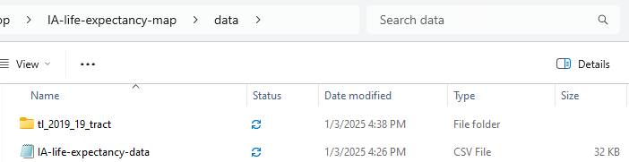
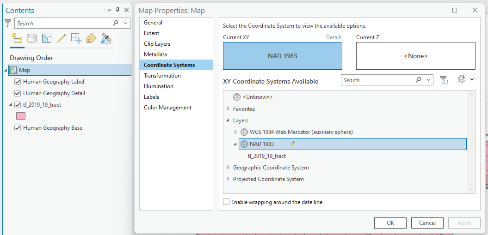

# ArcGIS Pro for Beginners
The following consists of a series of online [tutorials](https://ui-libraries.github.io/ArcGIS-Pro-For-Beginners/) introducing ArcGIS Pro to new users. The techniques presented here provide a broad overview of some of the most important components of working with ArcGIS Pro, from finding, downloading, and opening geospatial data, learning how to use basic geoprocessing and analysis tools, running Python code, projecting data, symbolizing data, and connecting to web services, to how to make and export a basic map. Upon completion of the full series, you should have a fairly thorough understanding of how to use ArcGIS Pro.

## Contents

- [Part 1: Finding Data and Opening in ArcGIS Pro](#part-1-finding-data-and-opening-in-arcgis-pro)
  - [Find and Download Data](#find-and-download-data)
  - [Adding Data to the Map Window](#adding-data-to-the-map-window)
  - [Setting the Map Projection](#setting-the-map-projection)
  - [Selecting and Exporting Features Using an Expression](#selecting-and-exporting-features-using-an-expression)
  - [Dissolving a Shapefile](#dissolving-a-shapefile)
  - [Clipping a Shapefile](#clipping-a-shapefile)
  - [Recap](#recap)
- [Part 2: Loading a CSV File, Performing Table Joins to Continuous Shapes, Choropleth Mapping](#part-2-loading-a-csv-file-performing-table-joins-to-continuous-shapes-choropleth-mapping)
  - [Loading Spreadsheet Data in ArcGIS Pro](#loading-spreadsheet-data-in-arcgis-pro)
  - [Converting Text Attributes to Integers](#converting-text-attributes-to-integers)
  - [Joining Attributes by Field Value](#joining-attributes-by-field-value)
  - [Choropleth Mapping](#choropleth-mapping)
- [Part 3: Connecting to a Web Service and Prepping Shapefiles for Analysis](#part-3-connecting-to-a-web-service-and-prepping-shapefiles-for-analysis)
  - [Connecting to a Web Service](#connecting-to-a-web-service)
  - [Reprojecting a Layer](#reprojecting-a-layer)   
- [Part 4: Analyzing How Much of X in Y](#part-4-analyzing-how-much-of-x-in-y)
  - [Introducing the Python Notebook](#introducing-the-python-notebook)
  - [Calculating Polygon Area](#calculating-polygon-area)
  - [Joining Attributes by Field Value (Again)](#joining-attributes-by-field-value-again)
  - [Use Calculate Field to Determine Percent Rec Land for Each Tract](#use-calculate-field-to-determine-percent-rec-land-for-each-tract)
  - [Extra: Saving Data to a CSV to Run Pearson's Correlation Coefficient in Excel](#extra-saving-data-to-a-csv-to-run-pearsons-correlation-coefficient-in-excel)
- [Part 5: Preparing and Exporting a Map in ArcGIS Pro](#part-5-preparing-and-exporting-a-map-in-arcgis-pro)
  - [Opening the Layout View](#opening-the-layout-view)
  - [Add a Map Frame to the Layout](#add-a-map-frame-to-the-layout)
  - [Adding a Legend](#adding-a-legend)
  - [Adding a Scale Bar](#adding-a-scale-bar)
  - [Thoughts on North Arrows](#thoughts-on-north-arrows)
  - [Adding Text Elements](#adding-text-elements)
  - [Exporting to a PDF](#exporting-to-a-pdf)

## Part 1: Finding Data and Opening in ArcGIS Pro
Let’s map life expectancy for census tracts in Iowa. What do we need?

### Find and Download Data
First, navigate to the <a href="https://www.cdc.gov/nchs/nvss/usaleep/usaleep.html#data" target="_blank">CDC website</a> to find life expectancy data by census tract. We could download data for the entire US, but let's scroll down to Iowa and select and download the csv in the second column.

  
**Figure 01**. Download Iowa census tract life expectancy data.

One of the most important aspects of doing GIS is having an organized file structure, so create a folder called "data" inside another folder called "IA-life-expectancy-map" and save your csv as "IA-life-expectancy-data.csv" inside your new data folder. Set the file format to "CSV UTF-8" when saving. Getting into this habit will preserve any special characters and save you headaches in the future.

At this point, you're probably wondering a few things about this spreadsheet. For one, there isn't any explicit geographic data (like coordinates) included in the data. How will you visualize this in a map? This will become clear soon. Just notice that there is a column called "Tract ID" and know that this will be important in the next step.

The first thing you will need to get your data into a map is a census tract shapefile for the State of Iowa. Proceed to the [US Census Bureau's TIGER/Line Shapefiles request form](https://www.census.gov/cgi-bin/geo/shapefiles/index.php). Choose 2019 for the year and "Census Tracts" for the layer type and submit the form.

  
**Figure 02**. Request 2019 census tracts.

Next, you will be prompted to select a state. Choose Iowa and click the download button.

  
**Figure 03**. Request census tracts shapefile for Iowa.

Unzip and place the entire shapefile folder (seven files) into your data folder. Check and make sure your folder structure is as follows:

  
**Figure 04**. Downloaded data within the project folder.

### Adding Data to the Map Window

Now that you have some data, you will want to open up ArcGIS Pro to see and map your data. Upon opening ArcGIS Pro, click "Map", name the project "IA-life-expectancy", navigate to the root of your project folder with the downloaded data, and save it by clicking "OK." 

  
**Figure 05**. Create a new ArcGIS Pro project.

Once you have ArcGIS Pro open, you can add the census tracts shapefile in one of two ways. The easiest way to add it is to drag the file with the ".shp" extension into the map window or table of contents. If all goes well, you will see all Iowa census tracts in your map window over the default basemaps.

Now, to practice the other method of adding data, right click on your layer in the table of contents on the left and click "Remove" to clear the data from the map.

  
**Figure 06**. Removing a layer from the map in ArcGIS Pro.

At the top of the screen, select "Map" and click "Add Data." You will notice that there are many options corresponding to different types of data. Navigate to your data folder and select the file with the ".shp" extension. Click "OK." As an important side note, any sort of shape (point, line, or polygon) is considered vector data. Any sort of scanned data or imagery is considered raster data. Many (but not all) basemaps consist of tiled raster data. Since this is a shapefile containing polygon data in the form of census tract boundaries, it is an example of vector data.

  
**Figure 07**. Adding a vector layer to the map in ArcGIS Pro.

If all goes well, you will see the census tracts of Iowa centered in the map window over the default basemaps. If you would like to change your basemaps, you can remove "World Topographic Map" and "World Hillshade" in the same way that you removed the shapefile. Click "Basemap" at the top and choose "Human Geography Map."

  
**Figure 08**. Adding a basemap.

Try selecting and experimenting with some more basemaps until you find one that you like.

### Setting the Map Projection

At this time, you should see your census tracts layered over Iowa on the basemap. However, you may notice that the state appears smooshed and a little too horizontally stretched. This is because, you have not set a projection that minimizes distortion over Iowa. Every map requires some amount of distortion as the curved surface of the Earth is projected to the flat surface of a map. The goal is to reduce this distortion as much as possible, so let's find a projection specific to the State of Iowa.

In the contents pane, right click "Map," select "Properties," and then choose "Coordinate Systems." In a box under "Current XY," you should see "NAD 1983," which is the current coordinate system that is being used to project the data.

  
**Figure 09**. Locating and changing the projection of your map.

In this window, you should see a search bar to the right of "XY Coordinate Systems Available." Type "Iowa" in this bar and press the return key. Click the dropdown arrow next to "Projected Coordinate System", the dropdown arrow next to "State Plane", and the dropdown arrow next to "NAD 1983 (2011) (US Feet)." Select "NAD 1983 (2011) StatePlane Iowa South FIPS 1402 (US Feet)." Click "OK."

  
**Figure 10**. Selecting a projection for your map.

After selecting a new projection for your map, you should notice a big improvement in the appearance to something more familiar. Now your map should look more like the image below.

  
**Figure 11**. An appropriate projection for Iowa.

Before moving on, save your progress. You can press Ctrl+S or click the button at the top-left of the screen that looks like a disk over a folder. In the next lesson, you will join your csv data to the census tracts shapefile. But, before proceeding to that step, let's get some practice with a few common GIS tools and processes that are necessary to know.

### Selecting and Exporting Features Using an Expression

What if we are only interested in the census tracts in Johnson County? There are a few ways we could isolate these. If you knew exactly where Johnson County was, you could use the select tool and manually highlight only the tracts in Johnson County. However, this method is prone to error. Instead, open the attribute table by right clicking the census tracts layer in your contents pane and clicking "Attribute Table." Notice that you have a column called "COUNTYFP." This is the county FIPS (Federal Information Processing Standards) code, and each geographical unit in the country has a unique numeric identifier. So, which number refers to Johnson County?

You can lean on an internet search to find the FIPS code for Johnson County. Doing so, I found this [handy map](https://www.cccarto.com/fipscodes/iowa/). From a quick glance, I can tell that the FIPS code for Johnson County, Iowa is 19103. Actually, it is 103, and 19 refers to the State of Iowa. Armed with this information, return to the census tract attribute table. Notice the button entitled "Select By Attributes" and click this.

With this tool open, select "COUNTYFP" after "Where," then select "is equal," and type "103" in the following box. Click "OK" at the bottom right.

  
**Figure 12**. Select features expression.

Returning to your active map, you should now see all of the census tracts in Johnson County highlighted in blue. Now, you can create a new layer from just the selected features. Right click on the census tract layer in the table of contents, click "Selection" -> "Make Layer From Selected Features."


**Figure 13**. Make layer from selected features.

You should notice a new layer in your contents pane that includes only the selected features. Next, you will save this layer in your project geodatabase. Doing this will save space and improve efficiency by avoiding the creation of large shapefiles. If you need to create a shapefile, you can always do so from this layer at a later time.

First, right click on the new layer in your contents pane. Click "Data" -> "Export Features."

  
**Figure 14**. Export selected features.

In the dialog box that opens, click the folder next to "Output Feature Class." In the next dialog box that opens, select "Databases" under "Project," choose "IA-life-expectancy.gdb," and type "johnson_2019_tracts" in the "Name" box. Click "Save." Back in the first dialog box, click "OK."

  
**Figure 15**. Save selected features.

Check your map again. You should see a new layer of Johnson County census tracts in your table of contents called "johnson_2019_tracts." Now you can remove the "tl_2019_19_tract selection" layer. Save your progress.

  
**Figure 16**. Johnson County census tracts.

Another way you could extract the Johnson County census tracts is if you had a shapefile for Johnson County. Since you don't, we are going to play with a few tools to build one and use it to extract the census tracts again. While this will not meet the map objectives, it will expose you to two very important GIS processes: dissolve and clip.

### Dissolving a Shapefile

Dissolving a shapefile will collapse all internal features of a shapefile so that you are left with one large polygon. To get a sense of the tools available to you through ArcGIS Pro, click "Analysis" -> "Tools" from the options at the top of the screen. In the Geoprocessing window that opens, toggle on "Toolboxes" and take a look at all of the different geoprocessing tools. Now, the the "Find Tools" bar at the top, type "dissolve" and select the first option.

  
**Figure 17**. Locating the Dissolve tool.

Use "johnson_2019_tracts" as the input layer, leave dissolve fields empty (more on this in a bit), and save the output to a layer in your geodatabase called "johnson_county." Press "Run" and check your map window. You should now see a single polygon for Johnson County.

  
**Figure 18**. Dissolve tool setup - 1.

You might have wondered what you can do with the dissolve fields in the Dissolve tool. This feature would be really helpful if you wanted a shapefile of Iowa counties, but did not want to scour the internet and download a totally new shapefile.

Open the Dissolve tool once again. This time, use the statewide census tracts shapefile as the input layer. Now, designate "COUNTYFP" as the dissolve field. This will find any features that share a value for "COUNTYFP" and collapse them into polygons for each unique value. Then, save the output layer to your geodatabase as "iowa_counties" and press "Run."

  
**Figure 19**. Dissolve tool setup - 2.

If you return to your map window, you can see that this process output a new shapefile of all of Iowa's 99 counties by dissolving each census tract into its encompassing county. Save your progress.

  
**Figure 20**. Iowa's 99 counties.

### Clipping a Shapefile

Now that you know some of the convenient functions available to you through the Dissolve tool. Let's take a look at the Clip tool. This tool is also referred to as the cookie cutter tool because you use the outline of a smaller shapefile to cut out the contents of a larger shapefile. In this case, you can use your Johnson County shapefile to cut out the Johnson County census tracts from the statewide census tract shapefile.

First, search for "Clip" in the geoprocessing pane search bar and choose the "Clip (Analysis)" tool at the top of the returns. In the tool's dialog box, designate the statewide census tracts (tl_2019_19_tract) as the input features and the Johnson County layer (johnson_county) as the clip features. Since we already have the census tracts for Johnson County, save this layer as "johnson_2019_tracts_2" to your geodatabase. Click "Run" and check your map window upon completion.

  
**Figure 21**. Clip tool settings.

Now, if you check your map window and zoom into Johnson County, you will see that this tool used your Johnson County shapefile and your statewide census tract shapefile to return a new shapefile of only the census tracts within your Johnson County shapefile.

  
**Figure 22**. Johnson County census tracts clip.

Once again, save your project.

### Recap

In this lesson, you learned a few of the most important aspects of using GIS to visualize and manipulate your data. You saw how reliable data is freely available on the internet for download and use. You learned different ways to load a shapefile into an active map edit session with ArcGIS Pro. You learned how to remove layers from the edit session. You saw how to add and change a basemap for spatial context. Next, you found out how to set an appropriate projection for your map project. After this, you learned how to select features using an expression and how to export these features to a new layer in a geodatabase. Finally, you learned about dissolving features to create new shapefiles for Johnson County and all the counties in Iowa. When you are ready, proceed to the next lesson!

## Part 2: Loading a CSV File, Performing Table Joins to Continuous Shapes, Choropleth Mapping

Last time, you downloaded some spreadsheet data on life expectancy by Iowa census tract, but we did not load this data in ArcGIS Pro.

### Loading Spreadsheet Data in ArcGIS Pro

To open your ArcGIS Pro map project, simply open ArcGIS Pro from you apps and click on "IA-life-expectancy" from the list of recent projects. This will open your project at your last save point. Now, navigate to the bar at the top and select "Map" -> "Add Data." In the window that opens, navigate to and select the IA-life-expectancy.csv file that you saved in your data folder. Click "OK."

  
**Figure 23**. Adding CSV data.

You will now see the spreadsheet included in your contents pane under "Standalone Tables." Right click on it and open the attribute table. Notice that the numeric entries in the column called "Tract ID" look similar to those in the census tract shapefile called "GEOID." We can join the spreadsheet data to the shapefile based on these shared data. However, there is one small step required before we can perform a successful join.

### Converting Text Attributes to Integers

You may have noticed that "GEOID" is left-aligned in text format, while "Tract ID" is right-aligned in integer format. We need both to be in the same format. Right click on the "tl_2019_19_tract" layer and open its attribute table. At the top of the attribute table, you will see a "Calculate" button, which will calculate and add a new field. Click this. In the box that opens, type "FIPS" for the field name and a data type of "Double (64-bit floating point)." In the text input box under "FIPS =", type "GEOID." Click "OK."

  
**Figure 24**. Calculate and add a new field.

Now, you are ready to join the life expectancy data from the csv file to the census tract shapefile based on these shared values.

### Joining Attributes by Field Value

This time, instead of opening the geoprocessing tool pane, you can right click the statewide "tl_2019_19_tract" layer and select "Joins and Relates" -> "Add Join." The census tracts shapefile will automatically appear as the input table. Since you have only one table in the contents pane, this should also automatically appear as the join table, but you can select the "IA-life-expectancy-data.CSV" file if not. Next, select "FIPS" for "Input Field." Then, choose "Tract ID" for the join field. Click "OK."

  
**Figure 25**. Join tool settings.

After you run this tool, you will notice that several features failed to join. This is because there are a few census tracts for which data are unavailable. This is unfortunate, but sometimes you just need to understand that there are limitations to your data. On the bright side, we now have quantitative data allowing us to make a beautiful color-coded map of life expectancy across Iowa. Save your progress.

### Choropleth Mapping

Mapping with color buckets is called **choropleth** mapping (NOT **Chloro**pleth). To begin, click the tl_2019_19_tract layer in the contents pane so that it is highlighted. This should make an option called "Feature Layer" available in the menu at the top. Click this. Next, click "Symbology" to open the symbology settings window. You will see that it is currently set to "Single Symbol." Change this to "Graduated Colors." For "Field," select "e(0)" and then select "Natural Breaks (Jenks)" for "Method" with 5 classes.

  
**Figure 26**. Initial choropleth settings.

Returning to the map window, you will now see all of the census tracts color coded base on their average life expectancy values. However, this color scheme is a little confusing. A good map maker needs to think about the audience, and many people associate a darker shade of red with a more negative value. Considering this, we should invert our color scheme or change the color palette. Let's try inverting.

Go back to the symbology window. Choose the dropdown option to the right of "Color scheme" and select "Format color scheme." In the color scheme editor window, click the button that looks like two side-by-side triangles and click "OK."

  
**Figure 27**. Invert choropleth settings.

The output is still not great. While this is a matter of opinion, my thoughts are that a single red color scale makes everything look negative and does not really convey a sense of difference around a larger average. For data regarding averages, it is probably a good idea to go with a divergent color scale around a neutral middle color. Try reclassifying with the RdYlGn scale. In the symbology window, click the color scheme bar and check the box next to "Show all." Scroll until you find a red-yellow-green color scheme

  
**Figure 28**. Set to RdYlGn choropleth scale.

This looks a little more intuitive to me. The tracts with the lowest life expectancies are now red, while those with the highest life expectancies are green. This seems more consistent with the reflexive associations people make with those colors. Unfortunately, this is still not an ideal choice. What if the map user happened to be color blind? Even if we're making a map for a presentation or article, we should always try to be as inclusive as possible when designing for a wide audience. Is there any way we can adjust our map for color blindness?

Fortunately, ArcGIS Pro has a View option that simulates color blindness. From the bar at the top of the screen, click "View" -> "Color Vision Simulation" to see all of the available preview options to simulate different types of color loss. Notice that this color scale doesn't work so well when filtered through the deuteranopia and protanopia color blindness simulations.

  
**Figure 29**. Simulating color blindness.

Instead, try using a blue-yellow-red scale called "Prediction" and reverse it using the technique described above. Try changing the yellow in the color scheme editor to white to make the middle life expectancy values appear neutral on the map. If you preview with the color blindness simulations, you will notice that these color differences are perceptible to someone with color blindness. Your map should now look like the one below.

  
**Figure 30**. Final color scheme.

This is looking good, but you might be wondering if you can make these colors somewhat transparent so that you can see the features of the base map beneath the styled census tracts layer.

In the options at the top of the screen, select "Feature Layer" and notice the "Transparency" option. Set this value to 40%.

  
**Figure 31**. Changing the layer transparency.

Return to your active map edit window and notice the difference. If you zoom in, you can now see the rivers and the road networks of the base map through the newly styled life expectancy layer. This is looking good, and you have made a lot of progress, so save your progress. For the time being, let's turn to something a little different to build up your GIS skillset. Keep your map project open and turn off all layers except the life expectancy census tract layer in your table of contents.

## Part 3: Connecting to a Web Service and Prepping Shapefiles for Analysis

Let's say we were interested in researching the correlation between recreational opportunities and life expectancy by census tract. Obviously, to claim any sort of possible causality, we would need a lot more research to withstand scrutiny. However, a map like this can provide a nice visual for conveying your thesis or findings to a wider audience. For this lesson, we will calculate the percentage of land devoted to recreational areas for each census tract so that we can compare this to the average life expectancy for each tract.

### Connecting to a Web Service

Instead of downloading data to our desktop, we can link ArcGIS Pro to a server on the web that hosts the public recreational land data we need. Using web services to access GIS data is a nice and convenient way to work with open source data. First, navigate to the Iowa DNR's [Recreation Atlas Web Service](https://iowadnr.maps.arcgis.com/home/item.html?id=c9a5551044a84ff6bf2fde343b9dac07). In the lower right corner of this page, you will notice a url that you can copy. For convenience, the url you need to copy is: https://programs.iowadnr.gov/geospatial/rest/services/Recreation/Recreation/MapServer.

From the options in the top bar, choose "Connections" -> "Server" -> "New ArcGIS Server" as shown in the screenshot below.

  
**Figure 32**. Selecting the Add ArcGIS REST Server Layer option.

In the dialog box that opens, paste the copied url (https://programs.iowadnr.gov/geospatial/rest/services/Recreation/Recreation/MapServer) into the URL box. Click "OK."

  
**Figure 33**. Connecting an Add ArcGIS FeatureServer Layer.

In the catalog window on the right side of the screen, notice that there is a new folder called "Servers." Click the dropdown for this. Then click the dropdown for the Iowa DNR server, the folder called "Recreation," the service called "Recreation," and then drag and drop the "Public Areas" layer into your map window.

  
**Figure 34**. Finding the feature service in the browser window.

You should now see splotches of green across your Iowa map representing all of the public parks and recreation areas in the state. We are almost ready to conduct our analysis, but there is some data prep we need to complete first.

### Reprojecting a Layer

In order to obtain accurate relative measurements for both the census tract and recreational area polygons, both layers should be in the same projection. By checking the layer properties of the "Public Areas" layer, you will notice that it is projected to UTM 15N. That is one of a few good projections for Iowa, so go ahead and project the "tl_2019_19_tract" layer to that projection. To do this, choose "Analysis" -> "Tools" and search for the tool called "Project" in the "Geoprocessing" window. Upon opening this tool, set up the dialog box as follows:

  
**Figure 35**. Reproject layer.

As shown, make sure to set the input to "tl_2019_19_tract" and save the output as "tl_2019_19_tract_UTM15N" to the project geodatabase. Next, set the output coordinate system to "NAD_1983_UTM_Zone_15N." The easiest way to do this is to click the dropdown arrow in the box and select the "Public Areas" layer, since this is in the desired projection. Click "Run." The new layer will automatically appear in the map edit window.

You may notice your table of contents filling up, and it may be getting a little confusing to differentiate between your layers. Go ahead and remove all layers from your table of contents, except "Public Areas," "tl_2019_19_tract_UTM15N," and "tl_2019_19_tract." Save your project. At this point, your map should look something like the one below.

  
**Figure 36**. Census tracts and public recreational lands.

## Part 4: Analyzing How Much of X in Y

You may have noticed that it was sort of a pain to run multiple tools individually, and you may be wondering if there is some way to program all of these tools to run automatically in succession. There is, but you will need to get comfortable with using some Python in the built-in Python Notebook. Python is a programming language, and the Python library you will need to use for data processing in ArcGIS Pro is baked into the software.

### Introducing the Python Notebook

To open the Python Notebook in ArcGIS Pro, click "Analysis" -> "Python" -> "Python Notebook." Notice that a window has opened in a new tab. There is an input box where you can enter and run code. Beneath this, outputs will appear as you run your code. In the input box, type:

```python
print("I'm using Python")
```

If you press the return key, you should notice that "I'm using Python" has logged beneath the input box. Now for something more exciting. In the next input box, type the following:

```python
import arcpy # Import the arc Python library

publicAreasLayer = "Public Areas" # You can use layer name if it is in the current map

field_list = arcpy.ListFields(publicAreasLayer) # Invoke the 'ListFields' method on 'publicAreasLayer'

for field in field_list: # Iterate through each field in the list
  print(field.name) # Print the name of each field
```

Press the "Run" button, which looks like a sideways triangle or play button. Notice that all of the fields in the "Public Areas" attribute table are displayed beneath the input code. Now you have access to this file for any processing you want to perform!

  
**Figure 37**. Coding with Python.

Now, continuing to add to this script, do the same thing with your "tl_2019_19_tract_UTM15N" layer.

```python
import arcpy # Import the arc Python library

publicAreasLayer = "Public Areas" # You can use layer name if it is in the current map

tractsLayer = "tl_2019_19_tract_UTM15N" # You can use layer name if it is in the current map

field_list = arcpy.ListFields(tractsLayer) # Invoke the 'ListFields' method on 'tractsLayer'

for field in field_list: # Iterate through each field in the list
  print(field.name) # Print the name of each field
```

Notice that, when you click the run button, you now see the fields from the attribute table of your tracts layer.

  
**Figure 38**. Reading field names with Python.

So you have possession of your shapefiles in the Python console. Time to run some tools!

One thing you may have noticed is that your "tl_2019_19_tract_UTM15N" layer does not contain the necessary life expectancy data. Instead of going back to the geoprocessing toolbox, you can take care of the join with a simple line of Python code:

```python
arcpy.management.JoinField(tractsLayer, "FIPS", lifeExpectancyTable, "Tract ID", ["e(0)"]) # This joins the life expectancy
```

Add this to your code block so that your entire script now looks like the following...

```python
import arcpy # Import the arc Python library

publicAreasLayer = "Public Areas" # You can use layer name if it is in the current map

tractsLayer = "tl_2019_19_tract_UTM15N" # The projected census tracts layer

lifeExpectancyTable = "IA-life-expectancy-data.CSV" # The data table with the life expectancy data

arcpy.management.JoinField(tractsLayer, "FIPS", lifeExpectancyTable, "Tract ID", ["e(0)"]) # This joins the life expectancy data to the tractsLayer using the shared FIPS codes
```

Now, add the following code to the end of the block to intersect the publicAreasLayer with the projected tractsLayer so that you will be able to measure the total recreation area for each census tract:

```python
arcpy.analysis.Intersect([tractsLayer, publicAreasLayer], "rec_tract_intersect") # This runs the intersection tool with your tracts and public recreation layers as the inputs and designates a new file called "rec_tract_intersect" to be output to your geodatabase
```

Before you press run, add another script to dissolve the output of the intersection by census tract:

```python
arcpy.management.Dissolve("rec_tract_intersect", "rec_tract_intersect_dissolve", "GEOID") # This performs a dissolve on the "rec_tract_intersect" layer to combine all recreational land within each census tract
```

The complete Python script should look like this:

```python
import arcpy # Import the arc Python library

publicAreasLayer = "Public Areas" # You can use layer name if it is in the current map

tractsLayer = "tl_2019_19_tract_UTM15N" # The projected census tracts layer

lifeExpectancyTable = "IA-life-expectancy-data.CSV" # The data table with the life expectancy data

arcpy.management.JoinField(tractsLayer, "FIPS", lifeExpectancyTable, "Tract ID", ["e(0)"]) # This joins the life expectancy data to the tractsLayer using the shared FIPS codes

arcpy.analysis.Intersect([tractsLayer, publicAreasLayer], "rec_tract_intersect") # This runs the intersection tool with your tracts and public recreation layers as the inputs and designates a new file called "rec_tract_intersect" to be output to your geodatabase

arcpy.management.Dissolve("rec_tract_intersect", "rec_tract_intersect_dissolve", "GEOID") # This performs a dissolve on the "rec_tract_intersect" layer to combine all recreational land within each census tract
```

Now, press the "Run" button.

If you check your contents pane, you will now see two new layers: "rec_tract_intersect" and "rec_tract_intersect_dissolve." You can remove "rec_tract_intersect." The nice thing about doing it this way is that you were able to perform two processes rapidly without having to open any dialog boxes. You just automated a workflow! While it would be more advanced Python scripting to make a GUI to handle this, you could imagine how you might develop an intersect-dissolve tool that could exchange your hard-coded inputs for user inputs, saving you and others tons of time. Make sure to save your project. The Python notebook saved in the "Notebooks" subdirectory of your project will be a good future reference if you want to dive into more Python scripting later.

Just to make sure everything is good, open the attribute table of the "rec_tract_intersect_dissolve" layer. Notice that all of the public recreational land is now dissolved by its encompassing census tract. We could continue working in Python, but let's take a break.

  
**Figure 39**. Result of Python script.

### Calculating Polygon Area

You want to calculate the percentages of each census tract devoted to recreational land. First, open the attribute table for "rec_tract_intersect_dissolve" and click the "Calculate" button at the top. This opens the Calculate Field tool. In the Calculate Field tool, set the input table to "rec_tract_intersect_dissolve", the field name to "rec_area," and the field type to "32-bit floating point." In the expression box at the bottom, type "!shape.getArea('GEODESIC','SQUAREMILES')!" and click "OK."

  
**Figure 40**. Using Calculate Field to calculate the area of recreational land in square miles.

Returning to the attribute table, you will now see a new column with the area of each polygon in square miles. Go ahead and do this for the "tl_2019_19_tract_UTM15N" layer, but call this additional field "tract_area" to emphasize that it is the area of the entire tract. Save your progress. Now we need to join the rec_area column from the "rec_tract_intersect_dissolve" layer to the "tl_2019_19_tract_UTM15N" layer attribute table.

### Joining Attributes by Field Value (Again)

From the top bar, select "Analysis" -> "Tools" and type "join field" in the geoprocessing search bar. Open the "Join Field" tool and fill out the dialogue box as follows:

  
**Figure 41**. Add recreational land area to the census tracts layer.

Notice that, under "Transfer Fields," I have selected only the "rec_area" field to copy over. Now, click "OK." You may have noticed that 174 features could not be matched. This is because some census tracts do not contain any public recreational land. Open the attribute table of "tl_2019_19_tract_UTM15N." You should notice, side by side, "tract_area" and "rec_area."

### Use Calculate Field to Determine Percent Rec Land for Each Tract

With the "tl_2019_19_tract_UTM15N" attribute table open, click the "Calculate" button. The first thing you need to do is to take care of the null values in the rec_area column. These occurred because some census tracts do not contain any public recreational land. Therefore, we can change these values to 0. In Calculate Field, make sure "Field Name" is "rec_area." In the expression box, type "0 if !rec_area! is None else !rec_area!" and click "OK."

  
**Figure 42**. Convert null rec area values to zero.

Check your attribute table to make sure everything looks good and reopen Calculate Field to calculate the percentage of each census tract devoted to public recreational space. This time, set "Field Name" to "perc_rec." In the expression box, type '(!rec_area!/!tract_area!)*100' and click "OK."

  
**Figure 43**. Calculate percent of each census tract devoted to recreational land.

If all goes well, you should now see in your attribute table that 66 is the highest value for the "perc_rec" column. Finally, style your "tl_2019_19_tract_UTM15N" layer by accessing "Feature Layer" -> "Symbology" as before, using "perc_rec" as the field, natural breaks as the method, 5 classes, and the "Greens (Continuous)" color scheme. Again, set the transparency to 40%. You should have two layers on your map, the "tl_2019_19_tract_UTM15N" layer colored green and the initial "tl_2019_19_tract" with the red-white-blue color scheme. The result should look like the following:

  
**Figure 44**. Visualizing percent recreational land by census tract.

  
**Figure 45**. Visualizing life expectancy by census tract.

From just a glance, I don't see too much of a correlation between the two measurements. If we wanted, we could run Pearson's r on the numbers and find out for sure. For now, save your project as usual.

### Extra: Saving Data to a CSV to Run Pearson's Correlation Coefficient in Excel

As mentioned, you may want to test your spatial stats for correlation. Remember, correlation does not equal causation, so this analysis should always be part of a larger rigorous study to determine a potential causative link. At the moment, I can think of several socioeconomic variables that are probably much more indicative of low life expectancy (poverty rate, percent of population uninsured or underinsured, smoking rates, and infant mortality to name a few). Still, it is never a loss to be able to prove the null hypothesis, so let's see what we find by comparing census tract life expectancy to recreational land coverage.

First, you need to select only the features in the "tl_2019_19_tract_UTM15N" layer that do not contain null values for the "e(0)" life expectancy column. Right click this layer in the contents pane and open its attribute table. Click "Select By Attributes" and fill in the where clause as shown below. Click "OK."


**Figure 46**. Select by attributes.

With the non-null features selected, right click the layer in the contents pane and click "Selection" -> "Make Layer From Selected Features." You should now notice a new layer in your contents pane. Right click this layer and choose "Data" -> "Export Table." When filling out the dialog box that opens, make sure to save the table **as a csv file** to the data subdirectory of your desktop project folder for easy access. Click "OK."

  
**Figure 47**. Exporting a layer to a CSV file.

Now, go to your data folder and open the exported CSV file in Excel. In Excel, you can easily measure correlation by selecting a new cell and typing "=PEARSON(P2:P799,S2:S799)" where P2:P799 is the life expectancy column and S2:S799 is the percent recreational land column. Upon pressing return, you should see -0.042195063 as the Pearson's r value.

  
**Figure 48**. Calculating Pearson's r in Excel.

Strong correlation is a number close to 1 or -1, so this value proves there is little to no correlation statewide between life expectancy and percent of land devoted to recreation. This is not to say there is no correlation at some other scale. For example, if you were very interested in this topic, you may wish to see if there is any correlation when testing for urban census tracts alone, as it is likely that access to recreational land matters relatively less in rural areas where most people are close to outdoor activities by default. Save your data.

## Part 5: Preparing and Exporting a Map in ArcGIS Pro

So how do you prepare a map for inclusion in a publication or presentation? First, you need to set up your map edit window so that only the layers you want to appear in the final map are visible. Also, you will want to make sure you have styled your map layers appropriately. For this exercise, you will finalize a map of life expectancy by census tract for the State of Iowa, so go ahead and remove all layers (but leave the base map!) except for "tl_2019_19_tract" so that your map edit window looks like this:

  
**Figure 49**. Preparing for finalization.

### Opening the Layout View

Now, save your map project and click "Insert" -> "New Layout" from the bar at the top. You will be prompted to choose a size. Select "Letter" under "ANSI - Landscape." A new window will open over your edit session.

  
**Figure 50**. Choose a layout.

### Add a Map Frame to the Layout

Now, click the "Map Frame" button at the top and select "Map," which will look like the map in your edit window. Now you can drag your cursor across the page to add the map. Make sure to leave some space around the margins for a title and additional text. Take a look at the image below for guidance. Save your progress.

  
**Figure 51**. Click to add a map to the layout.

### Adding a Legend

You are going to need a legend so that people can make sense of the data. Click "Legend" from the options at the top and choose "Legend 1." Just like you did with the map, click the print layout, drag, and release the legend in one of the corners. You will notice that the legend looks pretty bad. The good thing is that you can rework it.

If you click on the headers in the contents pane, you can edit the text. Change the layer title to "Life Expectancy" and the attribute "e(0)" to "Years." As you do this, you will notice these changes mirrored in the legend. Next, reduce each number to one decimal place. Save your progress. The result should look something like this:

  
**Figure 52**. Map and legend.

### Adding a Scale Bar

Now, just as you have done with the map and legend, find the button to add the scale bar, select one in the style and units you like, and add that to the map. Place the scale bar in the lower left corner, opposite to the legend. When making a map, you want to balance the content as much as possible. Save and continue.

  
**Figure 53**. Map with scale bar.

### Thoughts on North Arrows

You may want a north arrow. These are a must when deviating from the standard practice of orienting the top of the map to north. In all other circumstances, they tend to clutter the map. However, if you just can't do without one, you should add it to one of the empty corners of your map, keep it small, and use a subtle icon. The process for doing this is the same as adding a scale bar. Simply find the appropriate button and add.

### Adding Text Elements

The next necessary element is a title. Select the "Straight text" button from the options in the "Graphics and Text" box, as shown below.

  
**Figure 54**. Selecting straight text.

Now, drag the cursor across the top where the title should go and change the text to "Average Life Expectancy by Census Tract, Iowa." As you change the size of the box, you should notice the font size changing to match. Save your progress.


**Figure 55**. Adding a title.

Now, you need to add a byline. Again, click "Straight text" and add a smaller text box just below the title following the same steps listed above. This time, change the text to "By {Your Name}, {Your Credentials and Organization}, {The Current Year}" and save your progress.


**Figure 56**. Adding a byline.

Finally, you need to add references and other details. Add another label in the white space underneath the map in the bottom left corner. In the text box, replace the default text with:

Credits:<br>
Life expectancy data courtesy of the CDC, https://www.cdc.gov/nchs/nvss/usaleep/usaleep.html#data
Census tract polygons courtesy of the US Census Bureau, https://www.census.gov/cgi-bin/geo/shapefiles/index.php
Map Projection:
NAD83 / UTM zone 15N

Readjust your map elements so that your print layout looks like that below. Save your progress.


**Figure 57**. Final print layout.

### Exporting to a PDF

Now you are ready to export the layout to a PDF. From the options at the top, select "Share" -> "Export Layout" -> "Flattened PDF" 


**Figure 58**. Exporting to a PDF.

Before clicking "Export" in the dialog box, title your PDF "Iowa_Tracts_Life_Expectancy.pdf" and make sure the path is to your project folder. Set the quality to max and the vector resolution to 300 DPI. Click "Export" and, if you go to your project folder and open the exported PDF document, you will see a beautiful finalized map, which you can add to any number of documents for publication or presentation.


**Figure 59**. The final product.

Congratulations! I hope you learned a lot about using ArcGIS Pro for mapmaking and that this document proves to be a helpful reference in the future. Enjoy your mapping!
